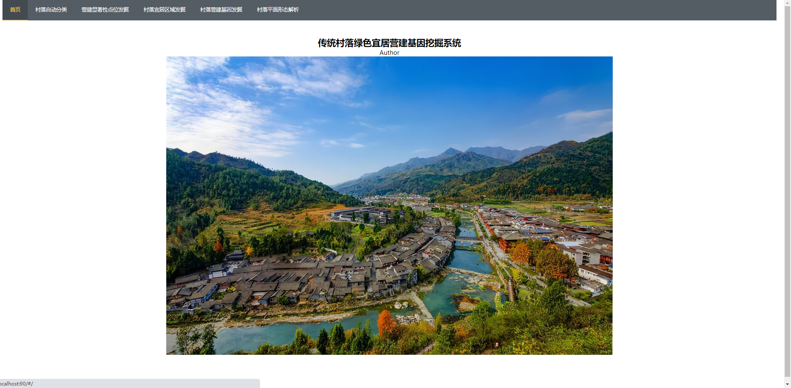
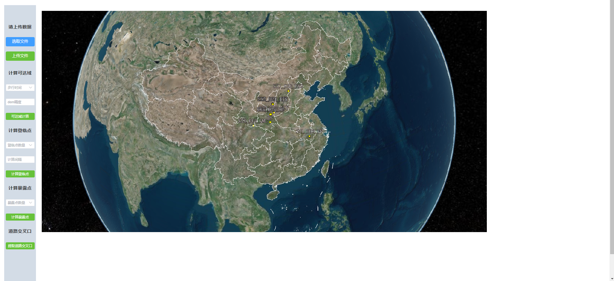

# Python_GeoProject
This is a project based on Python, using Flask and Cesium to build a digital terrain feature analysis system on
traditional villages.<br>
<br>Main functions include village edge detection, reachableArea generatation, denglinPoint calculate and exposivePoint calculate etc.
Details for technical words are explained below.

## Project Structure
* **Up_to_Domain**: *algorithm to calculate and generate reachableArea*.<br>
* **ascensionpoint_generate**: *algorithm based on viewshed generated to calculate ascensionpoint*.<br>
* **road_intersection**: *algorithm based on deeplearning and tensor voting to extract road intersection from remote sensing data*.<br>
* **static**: *directory for static resources and running results eg. js files, pics, raw data, algorithm result etc*.<br>
* **commonutils**: *directory for some useful tools*.<br>
* **config**: *directory for storing params, including save path and some hypeparameters*.<br>

* **run.py**: *main entrance to run the system*.<br>

other parts like "village_space_quantization" less importance
## Quick Start
### Prerequisites
* Python == 3.9.12
* CUDA >= 10 <br>
**WARNING**: Difference version of Python or other libs may cause installation errors<br>

First, create a virtual environment or install dependencies directly with:<br>
``` pip3 install -r requirements.txt```<br>
**Notice:** Some other packages installed from conda library, may use anaconda command like "anaconda search PACKAGE_NAME" 
and "anaconda show INSTALL_CHANNEL"

### Data preparation
Remote Sensing data and DEM data are required for the system main algorithms.
The remote data only requires 3-channel RGB images. The DEM data requires data based on RSG model. The two types of data 
need to be aligned in longitude and latitude directions.

<br>

### System Main Page
The main page has all function bandside above
<br>


Here is a short video of how to use the system:
<video src="[./系统演示视频.mp4](%CF%B5%CD%B3%D1%DD%CA%BE%CA%D3%C6%B5.mp4)" controls="controls" width="480" height="320">

### Reference
The deep learning part of this project modified from Bubbliiiing's repository [unet-pytorch](https://github.com/bubbliiiing/unet-pytorch.git).
Other part are all wrote alone.

